# Interactions de jeu

Ce document décrit les gestes principaux de Sérénimot et montre leur rendu sur ordinateur et sur smartphone.

Les captures ont été produites depuis l'application locale avec une partie déterministe. Elles servent de référence visuelle pour vérifier que les interactions restent cohérentes au fil des évolutions.

## Vue générale

Sur ordinateur, le plateau occupe la zone principale et la préparation du coup reste visible à droite.

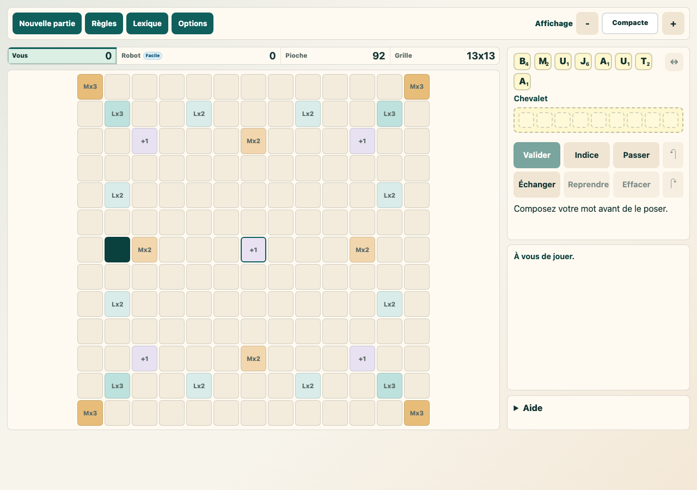

Sur smartphone, le plateau reste prioritaire. La zone de préparation et les actions rapides restent accessibles sous le plateau.

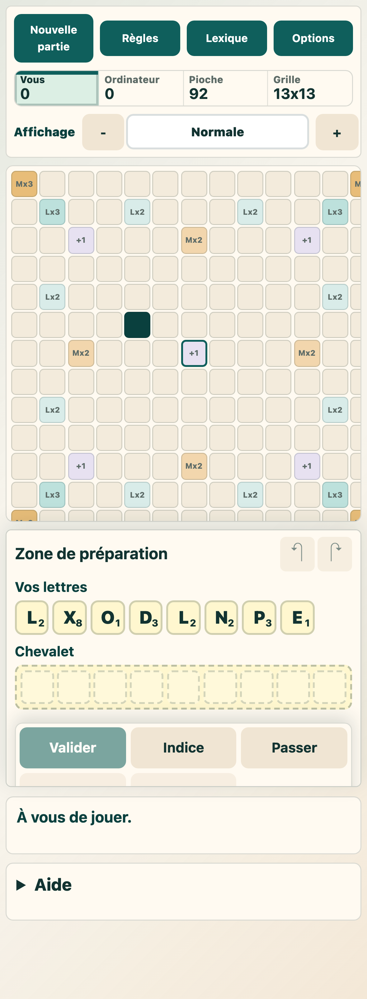

Le même geste de pose fonctionne sur téléphone : une case est choisie, puis une lettre est touchée.

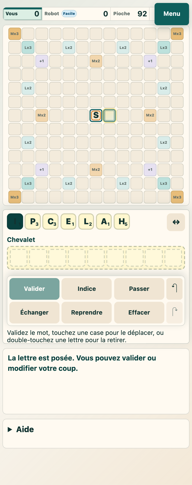

## Poser une lettre sur le plateau

Le placement tactile et souris suit le même principe :

1. choisir une case vide du plateau ;
2. toucher ou cliquer une lettre disponible ;
3. la lettre est posée sur la case choisie.

La case vide sélectionnée est visuellement marquée.

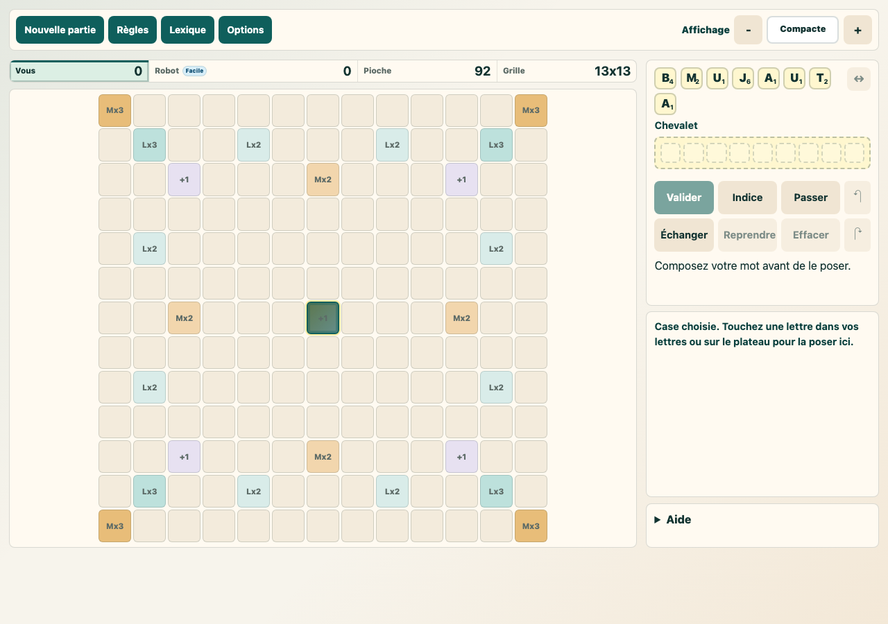

Après le choix d'une lettre, elle apparaît sur le plateau. Le coup peut encore être modifié avant validation.

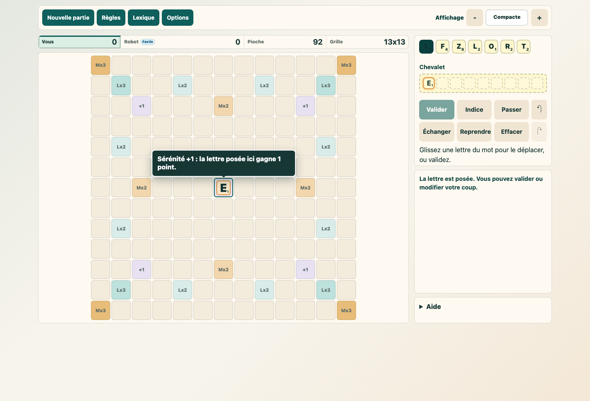

## Déplacer une suite déjà posée

Une suite de lettres posée pendant le tour peut être déplacée sans utiliser le glisser-déposer.
Le début du mot reste toujours la référence.

Le bouton `Sens → / ↓`, placé à droite des lettres disponibles, indique la direction actuelle. Avant
qu'une suite soit formée, il choisit si les prochaines lettres partent vers la droite ou vers le bas.
Quand une suite existe déjà, il tente de changer sa direction.

1. toucher ou cliquer une case vide pour déplacer le début du mot à cet endroit ;
2. ou toucher une lettre déjà posée pendant le tour pour déplacer le début du mot sur cette lettre ;
3. les lettres du tour gardent leur ordre et leurs positions relatives dans le mot visible.

Deux lettres sont ici déjà posées pendant le tour.

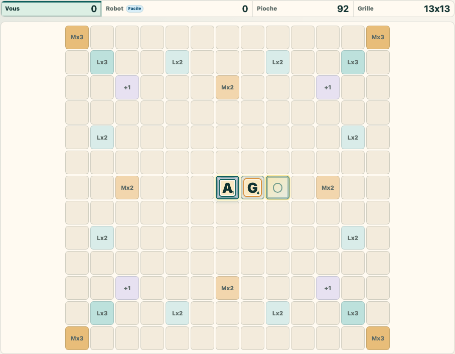

La nouvelle case de destination est sélectionnée.

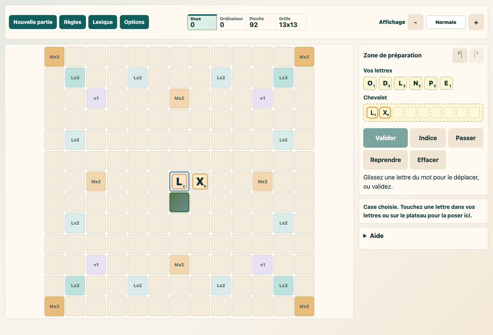

La suite est déplacée vers cette destination. Les autres lettres du coup suivent le début du mot.

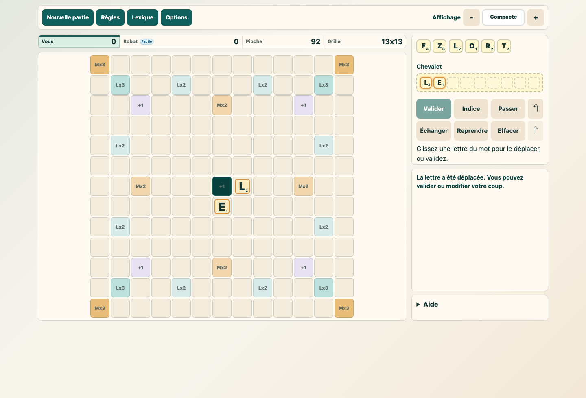

Pour retirer une seule lettre posée pendant le tour, double-cliquer ou double-toucher cette lettre.

## Utiliser le chevalet

Le chevalet permet de préparer un mot avant de le poser en une seule action sur le plateau. Il reste aussi possible de poser les lettres une par une.

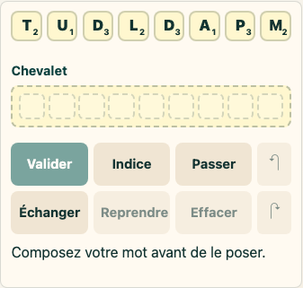

Un mot peut être préparé depuis les lettres disponibles.

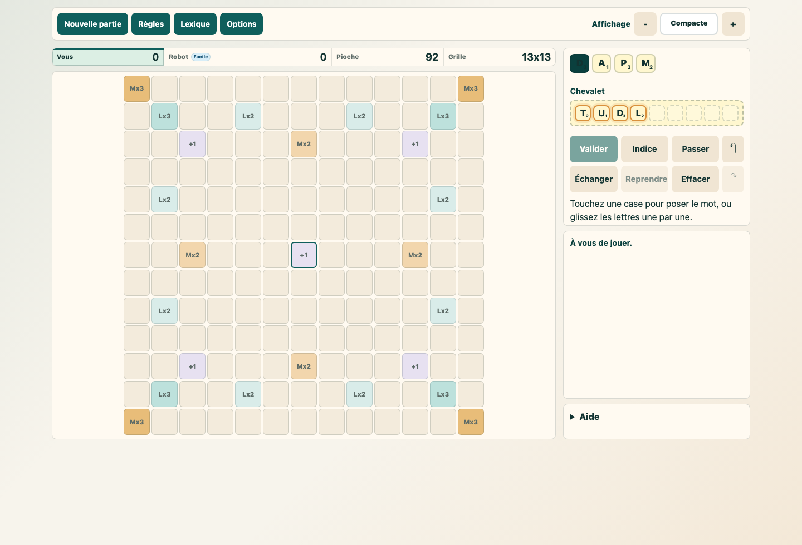

En touchant ou cliquant une case compatible, le mot préparé est posé sur le plateau.

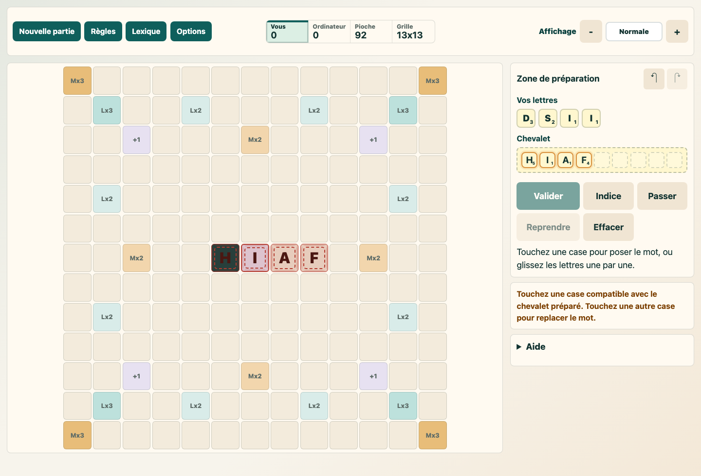

## Déplacer dans le chevalet

Le chevalet accepte deux modes complémentaires :

- glisser-déposer une lettre vers un autre emplacement ;
- sélectionner un emplacement vide, puis toucher une lettre du chevalet pour la déplacer vers cet emplacement.

Ces deux modes permettent d'organiser le mot sans dépendre d'un geste précis.

## Échanger des lettres

Le bouton `Échanger` permet de remplacer des lettres au lieu de poser un mot.

1. appuyer sur `Échanger` ;
2. si des lettres sont déjà posées pendant le tour ou préparées dans le chevalet, elles reviennent dans `Vos lettres` ;
3. toucher les lettres à remplacer dans `Vos lettres` ;
4. appuyer à nouveau sur `Échanger`.

Les lettres choisies retournent dans la pioche, le joueur reçoit le même nombre de nouvelles lettres et le tour est passé. Pendant la sélection, `Indice` et `Passer` restent visibles mais ne sont pas cliquables. Le bouton `Annuler` permet de quitter le mode échange avant confirmation.

Après l'échange, le jeu applique la même vérification qu'après `Passer` : si aucun nouveau mot ne peut être créé par les deux joueurs, la partie se termine. Si la pioche ne contient pas assez de lettres pour l'échange demandé, le joueur doit poser un mot ou passer son tour.

## Actions rapides mobiles

Sur smartphone, les actions principales sont regroupées dans une barre rapide :

- Valider ;
- Indice ;
- Passer ;
- Échanger ;
- Reprendre ;
- Effacer.

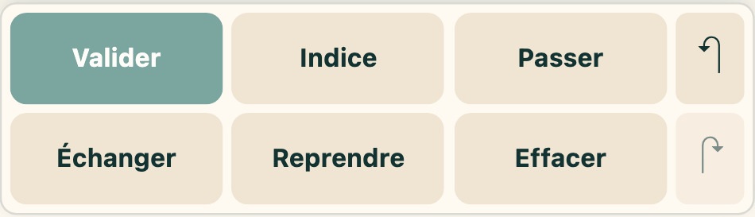

La zone de préparation mobile conserve les mêmes fonctions que sur ordinateur, avec des cibles plus adaptées au toucher.

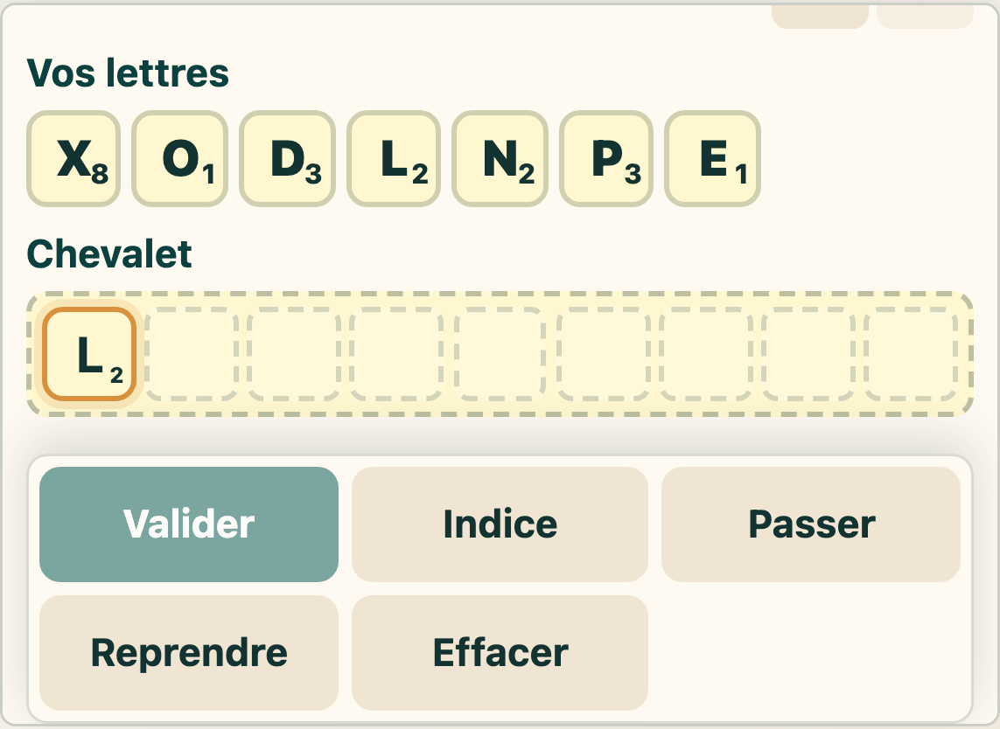

## Synthèse des gestes

| Situation | Geste | Résultat |
| --- | --- | --- |
| Case vide du plateau | Cliquer ou toucher | La case devient la destination sélectionnée. |
| Case sélectionnée + lettre disponible | Cliquer ou toucher la lettre | La lettre est posée sur la case sélectionnée. |
| Mot déjà posé ce tour + case vide | Cliquer ou toucher la case | Le début du mot est déplacé sur cette case. |
| Mot déjà posé ce tour + lettre du même mot | Cliquer ou toucher la lettre | Le début du mot est déplacé sur cette lettre. |
| Lettre déjà posée ce tour | Double-cliquer ou double-toucher | Seule cette lettre est retirée du plateau. |
| Lettre du chevalet | Glisser vers le plateau | La lettre est posée sur la case visée. |
| Lettre déjà posée sur le plateau | Glisser vers une case vide | La lettre est déplacée vers cette case. |
| Emplacement vide du chevalet | Cliquer ou toucher | L'emplacement devient la destination sélectionnée. |
| Emplacement du chevalet sélectionné + lettre | Cliquer ou toucher la lettre | La lettre se déplace vers l'emplacement sélectionné. |
| Bouton Échanger | Cliquer ou toucher | Les lettres du coup en cours reviennent dans Vos lettres, puis la sélection d'échange s'active. |
| Mode échange + lettres dans Vos lettres | Cliquer ou toucher les lettres | Les lettres sont sélectionnées ou retirées de la sélection d'échange. |
| Mode échange + bouton Échanger | Cliquer ou toucher | Les lettres choisies sont remplacées et le tour est passé. |
| Mode échange + bouton Annuler | Cliquer ou toucher | La sélection d'échange est abandonnée sans remplacer de lettre. |

## Points de cohérence à préserver

- Le glisser-déposer ne doit jamais être la seule méthode disponible.
- Un clic sur une lettre du mot posé doit déplacer la suite, pas retirer tout le mot.
- Un double-clic sur une lettre posée ne doit retirer que cette lettre.
- La sélection d'une destination doit être visible.
- Le mode échange doit toujours annoncer qu'il passe le tour et qu'il peut être annulé avant confirmation.
- Les actions mobiles ne doivent pas créer de doublons accessibles avec les actions ordinateur.
- Les règles de placement doivent rester identiques entre ordinateur, tablette et smartphone.
